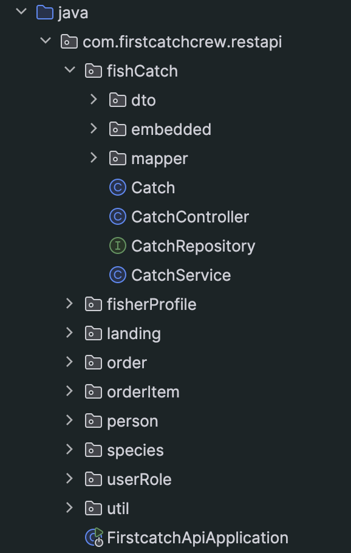
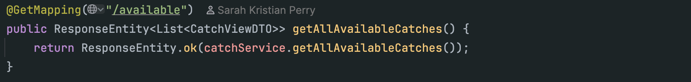
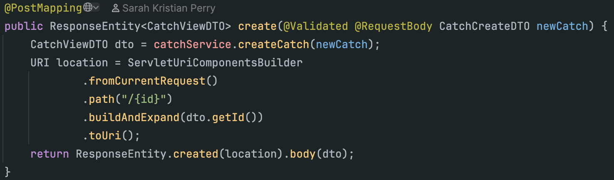
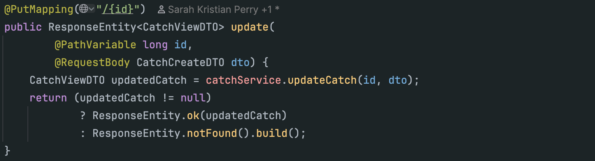
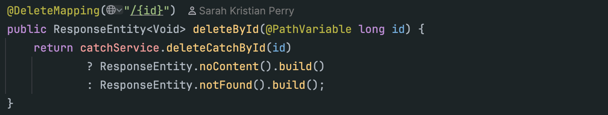

# First Catch API
This API will power FirstCatch, a community-driven platform designed to connect local fishers directly with customers—whether they’re individual buyers, families, or restaurants—seeking fresh, traceable seafood. Every posted catch includes where and when it was harvested, ensuring freshness and transparency. By giving small-scale fishers a direct channel to market their daily catch, FirstCatch supports local economies and promotes sustainable, wild-caught fish consumption.

## Technical Description:
A Java Spring Boot REST API that manages the FirstCatch application backend. It handles entities such as Catch, Person, FisherProfile, and Order, and provides endpoints to retrieve and manage seafood catch data, users (fishers/customers), and associated orders.

### Build Structure
We used a package-by-feature approach to build the project. Each package contains the code for a specific feature (including models, dtos, mappers, service, and controller), and the main package contains the entry point for the application.
<p align="center">  </p>

### How to Run
1. Navigate to the backend directory: ```cd firstcatch-api```

1. Build the project: ```mvn clean install```

1. Run the application:  ``` mvn spring-boot:run```

The API will be available at: http://localhost:8080/api

## Project Requirements:
- Uses Spring Boot to expose a REST API over HTTP
- Stores data in a relational DB (MySQL)
- fully tested in Postman with manual testing
- contains all HTTP verbs utilized in the API (GET, PUT, POST, DELETE)

#### Sample Postman tests

#### Sample HTTP Requests
GET Example
<p align="center">  </p>
POST Example
<p align="center">  </p>
PUT Example
<p align="center">  </p>
DELETE Example
<p align="center">  </p>

### Core entities:
- Person: (id, username, email, password, role)
  Represents a user of the system, either a fisher or customer.

- FisherProfile: (id, bio, person_id, catchList, defaultLanding)
  Extended profile for users with the fisher role, tied to their catches and location.

- Catch: (id, species, quantityInKg, price, available, sold, timestamp, geoLocation, pickupInfo, fisher_id)
  A fish catch posted by a fisher, including quantity, price, and location/time for pickup.

- Order: (id, customer_id, catch_id, status, timestamp)
  Represents a transaction where a customer reserves or buys a catch.

- Landing: (id, name, location)
  The physical pickup location for catches (e.g., a dock or fish plant).
  
- Species: (id, name, description, image)
  A description of the species.

### Relationships
- Person can be either a Customer or a Fisher, determined by their role
- FisherProfile belongs to exactly one Person, and a Fisher can post many Catches
- Customer (Person) can place many Orders
- Catch belongs to one FisherProfile, happens at one Landing, and may be associated with an Order
- Landing can be used for many Catches (pickup points)
- Order links a Catch and a Customer
